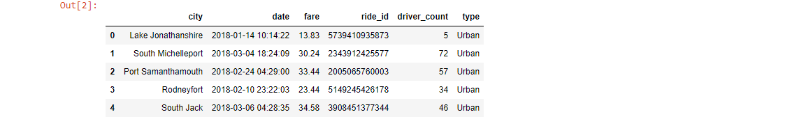
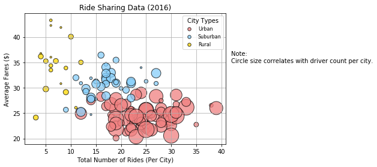
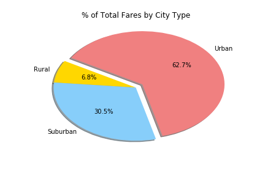
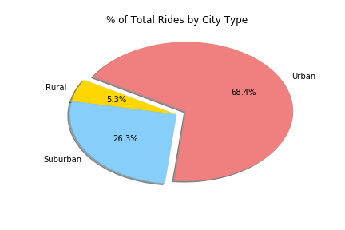
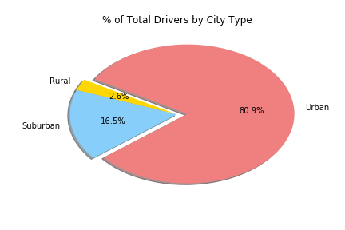

# Matplotlib-Challenge

Matplotlib Challenge of Ride-Sharing Service Data


## Analysis
* The highest percentages of fares, rides, and drivers are all in urban cities.
* Rural cities have a wider range of average fares than the other types of cities.
* Urban cities have a higher percentage of drivers than they have for rides. More data would allow us to look at whether or not urban cities have more drivers than are in demand.

## Breakdown


#### Dependencies and Setup

```python
# Allows for interactive plotting
%matplotlib inline

# Dependencies and Setup
import matplotlib.pyplot as plt
import pandas as pd
import numpy as np

# Load files
ride_data = "data/ride_data.csv"
city_data = "data/city_data.csv"

# Read the City and Ride Data
ride_df = pd.read_csv(ride_data)
city_df = pd.read_csv(city_data)

# Combine the data into a single dataset
main_df = pd.merge(ride_df, city_df, on="city", how="left")

# Display the data table for preview
main_df.head()
```



#### Scatter Plot of Ride Sharing Data by City Type

```python
# Make data frames by city
urban_cities = main_df[main_df["type"] == "Urban"].groupby([main_df["city"]])
suburban_cities = main_df[main_df["type"] == "Suburban"].groupby([main_df["city"]])
rural_cities = main_df[main_df["type"] == "Rural"].groupby([main_df["city"]])

# Calculate ride count (x is for x axis), fare average (y is for y axis), 
# and driver count average(s is for size) for each city group
urban_x = urban_cities["ride_id"].count()
urban_y = urban_cities["fare"].mean()
urban_s = urban_cities["driver_count"].mean()
suburban_x = suburban_cities["ride_id"].count()
suburban_y = suburban_cities["fare"].mean()
suburban_s = suburban_cities["driver_count"].mean()
rural_x = rural_cities["ride_id"].count()
rural_y = rural_cities["fare"].mean()
rural_s = rural_cities["driver_count"].mean()

# Make scatter plots for each city group
plt.scatter(urban_x, urban_y, s=urban_s*10, label="Urban", marker="o", color=["lightcoral"],
            edgecolor="black", alpha=0.75)
plt.scatter(suburban_x, suburban_y, s=suburban_s*10, label="Suburban", marker="o", color=["lightskyblue"],
            edgecolor="black", alpha=0.75)
plt.scatter(rural_x, rural_y, s=rural_s*10, label="Rural", marker="o", color=["gold"],
            edgecolor="black", alpha=0.75)

# Make grid, labels, legend (with markers in handles set to equal size), and note on circle size in plot
plt.grid()
plt.title("Ride Sharing Data (2016)")
plt.xlabel("Total Number of Rides (Per City)")
plt.ylabel("Average Fares ($)")
legend = plt.legend(title= "City Types", fontsize = 8, loc=0, scatterpoints=1)
for handle in legend.legendHandles:
    handle.set_sizes([30])
plt.text(42,35,"Note: \nCircle size correlates with driver count per city.", fontsize = 10)

# Save Figure
plt.savefig("Images/ride_share_scatter.png", bbox_inches="tight")

# Show plot
plt.show()
```




#### Percent of Total Fares by City Type

```python
# Calculate Type Percents
type_group = main_df.groupby(["type"])
total_fares = type_group["fare"].sum()

# Make Pie Chart
labels = ["Rural","Suburban","Urban"]
explode = (0,0,0.1)
colors = ["gold","lightskyblue","lightcoral"]

fig, ax = plt.subplots()
ax.pie(total_fares, labels=labels, explode=explode, colors=colors, autopct="%1.1f%%", shadow=True, startangle=150)
ax.set_title("% of Total Fares by City Type")
ax.set_aspect('auto')

# Save Figure
plt.savefig("Images/total_fares_pie.png")

# Show plot
plt.show()
```




#### Percent of Total Rides by City Type

```python
# Calculate Ride Percents
total_rides = type_group["ride_id"].count()

# Make Pie Chart
fig, ax = plt.subplots()
ax.pie(total_rides, labels=labels, explode=explode, colors=colors, autopct="%1.1f%%", shadow=True, startangle=150)
ax.set_title("% of Total Rides by City Type")
ax.set_aspect('auto')

# Save Figure
plt.savefig("Images/total_rides_pie.png")

# Show plot
plt.show()
```




#### Percent of Total Drivers by City Type

```python
# Calculate Driver Percents
city_type_group = city_df.groupby(["type"])
total_drivers = city_type_group["driver_count"].sum()

# Make Pie Chart
fig, ax = plt.subplots()
ax.pie(total_drivers, labels=labels, explode=explode, colors=colors, autopct="%1.1f%%", shadow=True, startangle=150)
ax.set_title("% of Total Drivers by City Type")
ax.set_aspect('auto')

# Save Figure
plt.savefig("Images/total_drivers_pie.png")

# Show plot
plt.show()
```




#### Notes

I was trying to find a way to alter the shapes of the pie charts. Mine were automatically oval which is what I thought they were supposed to be. However, when I was researching, I kept finding documentation stating that the automatic shape of the pie charts would be oval. I became very confused. I couldn't figure out how to change the shape of the pie charts from my automatic circles... until I came across 'fig, ax', 'ax.pie', 'ax.set_aspect' syntax. And sure enough 'auto' is an oval shape.